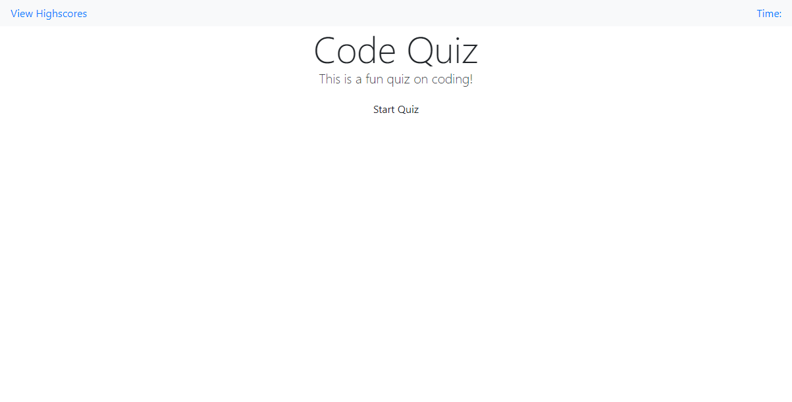

# Code Quiz README

## Requirements
* Build a timed coding quiz with multiple-choice questions
* This app will run in the browser
* Features dynamically updated HTML and CSS powered by JavaScript
* Have a clean, polished, and responsive user interface
* Start button that begins a timer and the test
* After each question is answered a new question is displayed
* Incorrect answers remove from the time remaining
* When the timer gets to 0 or all questions are answered the quiz ends
* At the end of the quiz prompt the user for initials to save the highscore
* Highscore list must be persitant

## Files & directories

* index&#46;html

* script&#46;js

* style&#46;css

* README&#46;md

## Links

#####[Link to webpage](https://jamesjtuckbc.github.io/Tuck-CodeQuiz/)
#####[Link to repo](https://github.com/jamesjtuckbc/Tuck-CodeQuiz)
### Pages

#### index.html

- - -

© 2020 Jorgen Tuck
